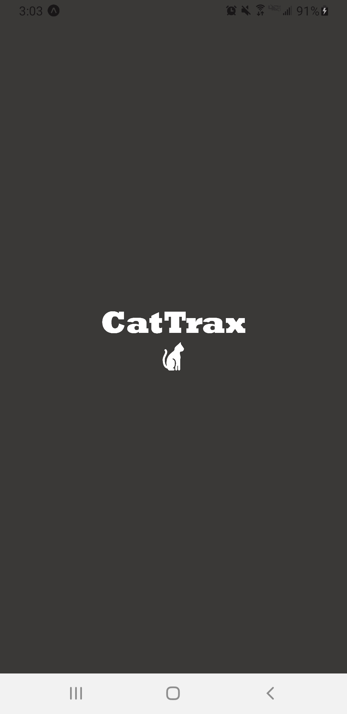
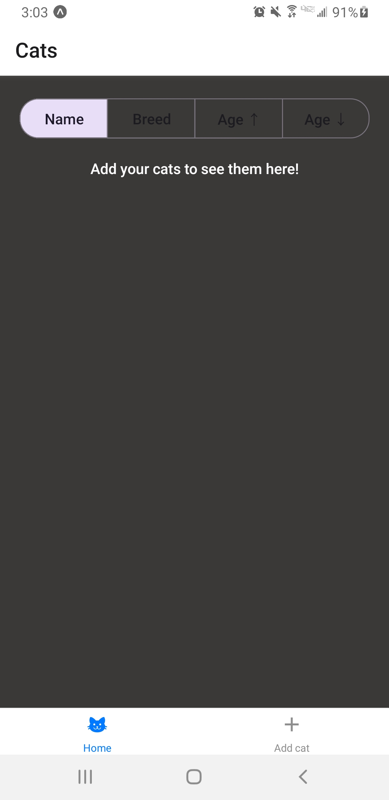
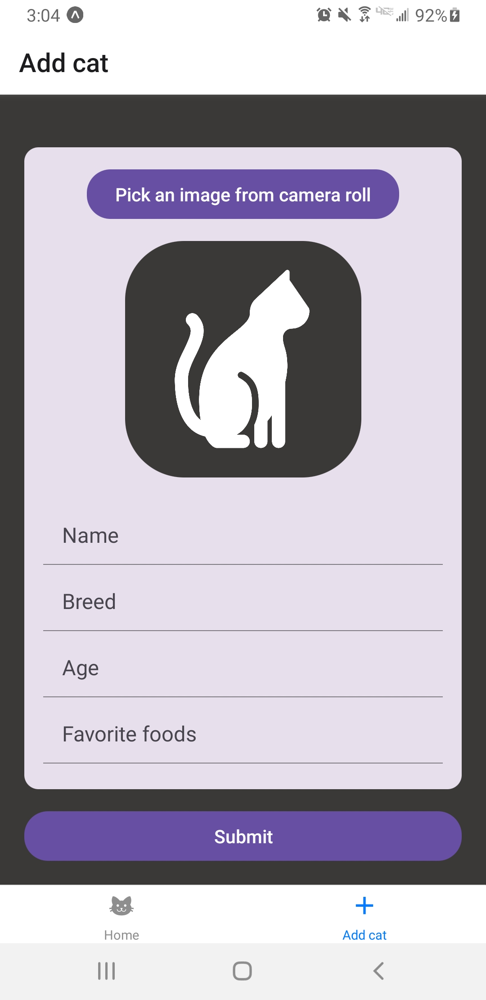
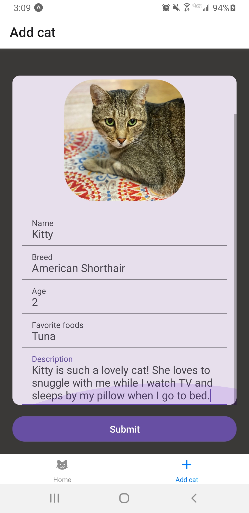
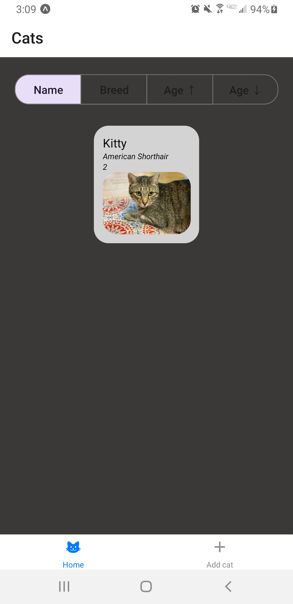
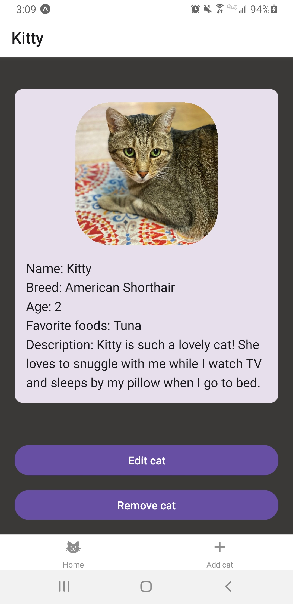
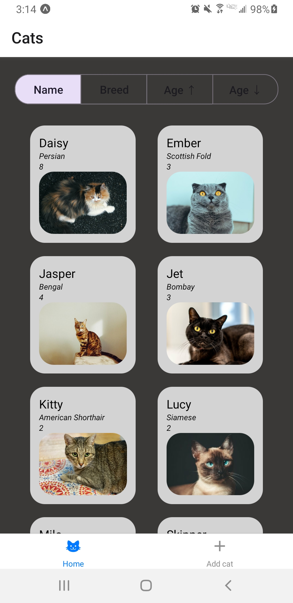
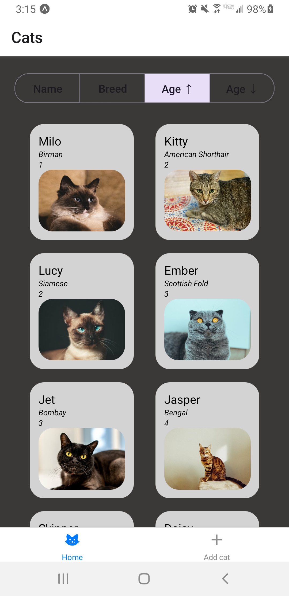
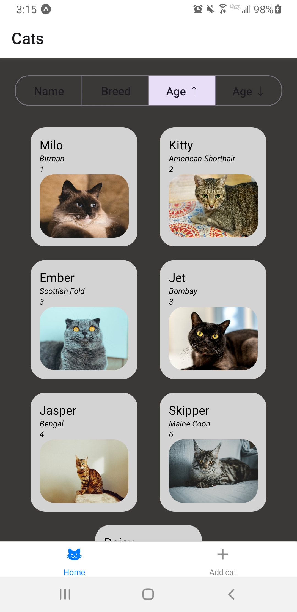

# Demo

## Splash screen

The user views the splash screen for CatTrax as the app loads.

## Home screen - empty

The user is prompted to begin adding cats. The user can sort cats by name or breed in alphabetical order and can sort cats by age in ascending or descending order.

## Add cat screen - empty

The user has several fields to fill out a cat's details: name, breed, age, favorite foods, description, and an image of the cat. The user can select an image to upload from the phone’s camera roll and apps associated with it such as a Google Drive.

## Add cat screen - filled

The user can scroll through the form's input if it exceeds its container. This is shown in the screenshot where the scroll area is being pulled down, and the scrollbar can be seen on the right of the container.

## Home screen - cat added

After pressing submit in the cat added screen, the user is redirected to the home page where the newly added cat can be seen. The user can view the details of a cat by pressing on its cat overview card.

## Cat detail screen

The user gets redirected to the cat detail screen for a given cat after selecting it in the home screen. The user can choose to begin editing this cat's details or remove it.

## Edit cat screen

The user can edit a cat's details. This form is uploaded with the selected cat's previous information for easy editing upon initial render of the screen.

## Home screen - cats added and sorted by name

The user can sort by name, breed, and age. Here, the cats are sorted by name.

## Home screen - cats added and sorted by ascending age

The user can sort by name, breed, and age. Here, the cats are sorted by age in ascending order.

## Home screen - removed a cat

The user can remove a cat and the cat list will update. Here, Lucy was removed.

---

---

## Instructions

### Build your app

You have 1 week to complete the challenge.

Implementation and design will be evaluated.

### Submit your challenge

Follow these instructions to submit your challenge.

- Fork this Repository
- Setup your Development Environment
- Write your Code
- Create a PR off of your forked repo
- Send me the PR so I can review it :)

### Impress us with your skills

Challenge:

Jack owns so many cats that he can't keep track of all of them. He needs some way to keep track of all of his cats - almost like a Pokédex for cats.

### Requirements

Your app should be able to complete the following tasks:

- Add a new Cat (Name, Breed, Description, or anything else you think would be important)
- Remove Cats
- Edit Cats
- List all of his Cats
- Persist data using React Contexts or Redux

### Grading

The grading of the app will be based off of three criteria:

- 30% - UI and UX
- 40% - Overall Design and Structure
- 30% - Data Management and Store

---

## Set up your development environment:

If you have any issues following this README, try this resource: https://docs.expo.dev/get-started/create-a-project/

Firstly, Fork this repo

### start development server

Notes on installing the Expo CLI: https://docs.expo.dev/more/expo-cli/

To run:

`npx expo start`

This should create a window like this:

You have 2 options for developing:

- if you have your mobile phone, you can install the Expo Go app and scan the QR code that shows up.
  This is the easiest way to get started fast.
- If you want to run on an emulator

  - if on mac, you can either install simulator (ios) or android studio. I recommend simulator:
    the shortcut to launch the app on the simulator after running expo start is : i

  - if on Windows, you must install android studio, open Virtual Device manager, launch an android emulator.
    The shortcut to launch the app on the simulator after running expo start is : i

---
